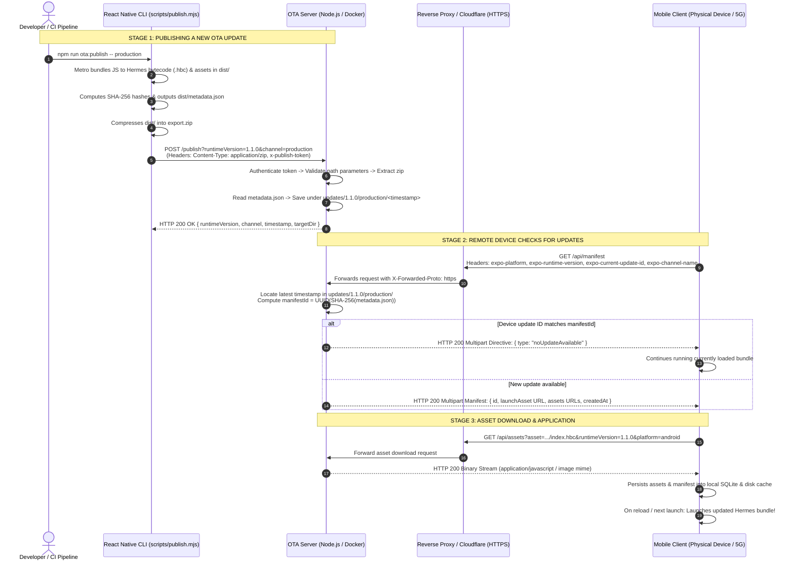

# OTA Server

A self-hosted, lightweight Over-The-Air (OTA) update server fully compliant with the [Expo Updates protocol (v1)](https://docs.expo.dev/technical-specs/expo-updates-1/).

This server allows React Native and Expo applications utilizing `expo-updates` to query, download, and apply JavaScript bundles and static asset updates (bug fixes, UI updates, business logic changes) **instantaneously without passing through EAS Update, app store review delays, or requiring native APK/AAB rebuilds.**

---

## Table of Contents

- [Key Features](#key-features)
- [Requirements](#requirements)
- [Configuration](#configuration)
- [Running the Server](#running-the-server)
  - [Option A: Docker Compose (Recommended)](#option-a-docker-compose-recommended)
  - [Option B: Node.js Directly](#option-b-nodejs-directly)
- [End-to-End Architecture & Operational Workflow](#end-to-end-architecture--operational-workflow)
  - [Sequence Flow Diagram](#sequence-flow-diagram)
  - [Technical Deep Dive 1: Publishing Process (React Native Client)](#technical-deep-dive-1-publishing-process-react-native-client)
  - [Technical Deep Dive 2: Update Ingestion & Storage Layout (OTA Server)](#technical-deep-dive-2-update-ingestion--storage-layout-ota-server)
  - [Technical Deep Dive 3: Client Update Resolution & Delivery (Remote Devices)](#technical-deep-dive-3-client-update-resolution--delivery-remote-devices)
  - [Technical Deep Dive 4: Native Code Changes vs. OTA Updates (Runtime Isolation)](#technical-deep-dive-4-native-code-changes-vs-ota-updates-runtime-isolation)
- [Client Integration (React Native App)](#client-integration-react-native-app)
  - [Configuring `app.json`](#configuring-appjson)
  - [Publishing Script (`scripts/publish.mjs`)](#publishing-script-scriptspublishmjs)
  - [Self-Hosted Deep Linking Fix](#self-hosted-deep-linking-fix)
- [Publishing an Update](#publishing-an-update)
  - [Using the Publish CLI](#using-the-publish-cli)
  - [Publishing via cURL / Custom CI](#publishing-via-curl--custom-ci)
- [Web Dashboard](#web-dashboard)
- [API Reference](#api-reference)
- [Storage Layout](#storage-layout)
- [Deploying to Production Cloud](#deploying-to-production-cloud)
  - [Deployment Checklist](#deployment-checklist)
  - [Nginx Reverse Proxy Configuration](#nginx-reverse-proxy-configuration)
- [Security Considerations](#security-considerations)
- [Troubleshooting & Resolved Edge Cases](#troubleshooting--resolved-edge-cases)
- [Automated Testing](#automated-testing)

---

## Key Features

- **Expo Updates Protocol v1 Compliance**: Implements multipart/mixed manifest responses, `directive` payloads (`noUpdateAvailable`), and asset streaming.
- **Dockerized Multi-Container Setup**: Packaged with a production-ready Alpine Linux Docker container and an automated Cloudflare Tunnel (`cloudflared`) sidecar for immediate remote testing over public HTTPS without opening router ports.
- **Strict Version Isolation**: Segregates releases by `runtimeVersion` and `channel`, preventing incompatible JavaScript bundles from running on native binaries with mismatched native modules.
- **Robust Path Traversal Prevention**: Comprehensive segment sanitization (`isSafePathSegment`) defending against directory traversal exploits (`../`).
- **Cross-Platform Compatibility**: Automatically normalizes file paths (converting Windows backslashes `\` to Linux forward slashes `/`) when archives exported on Windows hosts are unzipped inside Linux Docker environments.
- **Reliable Timestamp Parsing**: Resolves release `createdAt` metadata from the bundle directory timestamp, circumventing the Docker Alpine bind-mount 0-epoch birthtime bug.
- **Channel Fallback**: Gracefully falls back to the `production` channel if the client requests an unpopulated or missing development/preview channel.
- **Lightweight Administration Dashboard**: Built-in dark-themed web interface to view published releases, manifest IDs, creation dates, and delete superseded releases.
- **Zero Database Dependency**: All update metadata and assets are maintained directly on disk.

---

## Requirements

- **Node.js**: Version 18.0.0 or higher.
- **Docker & Docker Compose** (Optional, recommended for isolated containerized deployment).
- **React Native / Expo App**: Configured with `expo-updates` (~0.25.x or compatible).

---

## Configuration

The server is configured via environment variables. Create a `.env` file in the root directory:

```bash
cp .env.example .env
```

```dotenv
PORT=3001
PUBLISH_TOKEN=your-strong-random-secret-token-here
```

### Environment Variables

| Variable | Required | Default | Description |
|---|---|---|---|
| `PORT` | No | `3001` | The local port on which the Express HTTP server listens. |
| `PUBLISH_TOKEN` | Yes | *None* | Shared secret required in the `x-publish-token` header when calling `POST /publish`. If unset, publishing is disabled (returns HTTP 501). |

> **Security Tip**: Generate a cryptographically secure token using:
> ```bash
> node -e "console.log(require('crypto').randomBytes(24).toString('hex'))"
> ```

---

## Running the Server

### Option A: Docker Compose (Recommended)

The included `docker-compose.yml` launches both the OTA update server and a Cloudflare Tunnel sidecar.

```bash
docker compose up -d
```

1. **Local Access**: Open [http://localhost:3001](http://localhost:3001) to access the web dashboard.
2. **Public HTTPS Tunnel**: To inspect the temporary public Cloudflare Tunnel URL, run:
   ```bash
   docker logs ota-tunnel
   ```
   Look for lines resembling:
   ```text
   Your quick Tunnel has been created! Visit it at:
   https://random-subdomain.trycloudflare.com
   ```
   Use this HTTPS URL in your app's `app.json` (`updates.url`) for testing physical devices across mobile networks (4G/5G).

### Option B: Node.js Directly

```bash
npm install
npm start
```

Output:
```text
OTA server listening on http://localhost:3001
```

---

## End-to-End Architecture & Operational Workflow

### Sequence Flow Diagram



---

### Technical Deep Dive 1: Publishing Process (React Native Client)

When executing `npm run ota:publish -- production`, the client CLI performs the following operations:

1. **Reading Configuration**: Reads `app.json` from the repository root to determine `expo.runtimeVersion` (e.g., `1.1.0`). If omitted, defaults to `1.1.0`.
2. **Metro Export (`npx expo export`)**:
   - Invokes Metro to compile all JavaScript and TypeScript source files starting from `index.tsx`.
   - Transpiles code to **Hermes Bytecode (`.hbc`)** for Android.
   - Extracts all referenced static assets (fonts, PNGs, SVGs, JPGs).
   - Generates a file-index manifest: `dist/metadata.json`. Each asset entry includes its relative path and SHA-256 hash.
3. **Packaging (`export.zip`)**:
   - Recursively compresses the contents of the `dist/` directory into `export.zip` using PowerShell (`Compress-Archive`) or `zip`. The `metadata.json` file resides at the root of the archive.
4. **HTTP Upload Request**:
   - **Method**: `POST`
   - **Target Endpoint**: `http://localhost:3001/publish?runtimeVersion=1.1.0&channel=production`
   - **Request Headers**:
     - `Content-Type`: `application/zip`
     - `x-publish-token`: Value of `OTA_PUBLISH_TOKEN` from `.env`
   - **Body**: Raw binary stream of `export.zip`.
5. **Cleanup**: Automatically deletes the temporary `export.zip` upon completion.

---

### Technical Deep Dive 2: Update Ingestion & Storage Layout (OTA Server)

When the server receives the `POST /publish` request:

1. **Raw Body Parsing**: Express captures the stream via `express.raw({ type: "application/zip", limit: "100mb" })`.
2. **Security & Parameter Validation**:
   - Verifies the `x-publish-token` header matches `process.env.PUBLISH_TOKEN`.
   - Validates `runtimeVersion` and `channel` using `isSafePathSegment()`: enforces alphanumeric characters, hyphens, underscores, and dots, explicitly rejecting `.` and `..` to prevent Path Traversal attacks.
3. **Temporary Extraction**:
   - Creates a unique temporary directory via `fs.mkdtempSync()`.
   - Decompresses the archive using `AdmZip.extractAllTo()`.
   - Validates that `metadata.json` exists at the root of the extracted contents.
4. **Permanent Storage Layout**:
   - Computes a monotonic timestamp: `Date.now().toString()`.
   - Copies all files into:
     ```text
     updates/<runtimeVersion>/<channel>/<timestamp>/
     ```
   - Normalizes Windows backslashes (`\`) to Linux forward slashes (`/`) in `metadata.json` to ensure platform compatibility inside Docker containers.
5. **Response**: Responds with `HTTP 200 OK` returning `{ runtimeVersion, channel, timestamp, targetDir }`.

---

### Technical Deep Dive 3: Client Update Resolution & Delivery (Remote Devices)

When a physical mobile device running the application connects to the network:

1. **Manifest Request**:
   `expo-updates` sends an HTTP GET request to `/api/manifest` containing standard Expo protocol headers:
   - `expo-platform`: `android` or `ios`.
   - `expo-runtime-version`: Identifies the native runtime boundary (e.g., `1.1.0`).
   - `expo-channel-name`: Distribution channel (e.g., `production`).
   - `expo-current-update-id`: UUID of the bundle currently executed by the device.
2. **Finding the Candidate Update**:
   - The server inspects `updates/<runtimeVersion>/<channel>/` and locates the folder with the highest numeric timestamp.
   - If the requested channel does not exist, the server automatically attempts to fall back to the `production` channel.
3. **Manifest ID Derivation**:
   - Reads `metadata.json` within that folder.
   - Computes the SHA-256 hash of `metadata.json`.
   - Formats the hash into an RFC 4122 compliant UUID (8-4-4-4-12 characters) via `convertSHA256HashToUUID()`.
4. **Update Evaluation**:
   - If `expo-current-update-id` matches the computed `manifestId`, the server returns a multipart directive:
     ```json
     { "type": "noUpdateAvailable" }
     ```
   - If the IDs differ, the server constructs a multipart manifest containing:
     - `id`: The new UUID.
     - `createdAt`: ISO 8601 string derived from the timestamp directory.
     - `launchAsset`: URL pointing to `/api/assets?asset=.../index.hbc`.
     - `assets`: Array of URLs pointing to static fonts and images.
5. **Asset Streaming & Download**:
   - The client fetches all missing assets concurrently via `GET /api/assets`.
   - The server validates that requested paths reside strictly within the update directory, streaming the file with proper MIME types.
6. **Persistence & Error Recovery**:
   - The client stores assets into its internal SQLite database and filesystem storage.
   - **Crash Protection**: If an update encounters a fatal crash prior to native initialization (before `CONTENT_APPEARED`), Expo's native error recovery records the failure in `expo-recent-failed-update-ids` and rolls back to the embedded bundle.

---

### Technical Deep Dive 4: Native Code Changes vs. OTA Updates (Runtime Isolation)

Understanding the boundary between JavaScript OTA updates and Native code updates is vital:

```
┌────────────────────────────────────────────────────────────────────────┐
│                        OTA UPDATE ELIGIBILITY                          │
├──────────────────────────────────┬─────────────────────────────────────┤
│   ✅ Allowed via OTA Update      │   ❌ Requires Full Native Rebuild   │
├──────────────────────────────────┼─────────────────────────────────────┤
│ • JavaScript & TypeScript logic  │ • Adding/updating native libraries  │
│ • React components & screens     │ • Modifying AndroidManifest.xml     │
│ • Styles, theming, and layout    │ • Changes to gradle, Podfile, Java  │
│ • Static assets (PNG, JPG, SVG)  │ • Adding native device permissions  │
│ • Local strings & i18n copy      │ • Updating React Native or Expo SDK │
└──────────────────────────────────┴─────────────────────────────────────┘
```

#### The Role of `runtimeVersion`
The `runtimeVersion` field in `app.json` defines a contract between the native binary and the JavaScript bundle.

- When publishing an update under `runtimeVersion: "1.1.0"`, the update is stored under `updates/1.1.0/`.
- Only devices compiled with `runtimeVersion: "1.1.0"` will request and receive updates from that path.
- Older devices compiled with `runtimeVersion: "1.0.0"` will never receive `1.1.0` bundles, preventing crashes caused by missing native bridges.

#### Native Update Lifecycle Workflow

When introducing native changes (e.g., adding a native camera or biometrics module):

1. **Increment Versions in `app.json`**:
   ```json
   {
     "expo": {
       "version": "1.2.0",
       "runtimeVersion": "1.2.0",
       "android": {
         "versionCode": 2
       }
     }
   }
   ```
2. **Build and Distribute New Native APK/AAB**:
   Compile the new release binary using Gradle or EAS Build, and distribute it to your users.
3. **Publishing Subsequent OTA Updates**:
   When you run `npm run ota:publish`, the script reads `runtimeVersion: "1.2.0"` from `app.json` and publishes to `updates/1.2.0/production/`. Existing users on version `1.1.0` will remain unaffected on their compatible update track.

---

## Client Integration (React Native App)

### Configuring `app.json`

Configure the `updates` section in your React Native project's `app.json`:

```json
{
  "expo": {
    "name": "BaseApp",
    "slug": "base-app",
    "version": "1.1.0",
    "runtimeVersion": "1.1.0",
    "updates": {
      "enabled": true,
      "checkAutomatically": "ON_LOAD",
      "fallbackToCacheTimeout": 30000,
      "url": "https://your-ota-server.com/api/manifest"
    }
  }
}
```

> **Note**: For local development or quick testing across 4G/5G, set `url` to your public Cloudflare Tunnel URL (e.g., `https://your-tunnel.trycloudflare.com/api/manifest`).

### Publishing Script (`scripts/publish.mjs`)

Include `scripts/publish.mjs` in your React Native project:

```javascript
import { execSync } from "node:child_process"
import fs from "node:fs"
import path from "node:path"

const channel = process.argv[2] || "production"
const serverUrl = process.env.OTA_SERVER_URL || "http://localhost:3001"
const token = process.env.OTA_PUBLISH_TOKEN || "baseapp-ota-secret-token-2026"

const appJson = JSON.parse(fs.readFileSync(path.resolve("app.json"), "utf-8"))
const runtimeVersion = appJson.expo?.runtimeVersion || "1.1.0"

console.log(`📦 Publishing OTA: runtimeVersion=${runtimeVersion}, channel=${channel}`)

// 1. Export Android bundle using Metro
execSync("npx expo export --platform android --output-dir dist", { stdio: "inherit" })

// 2. Compress dist/ directory
if (fs.existsSync("export.zip")) fs.unlinkSync("export.zip")
execSync("powershell Compress-Archive -Path dist\\* -DestinationPath export.zip -Force", { stdio: "inherit" })

// 3. Upload to self-hosted server
const zipBuffer = fs.readFileSync("export.zip")
const uploadUrl = `${serverUrl}/publish?runtimeVersion=${encodeURIComponent(runtimeVersion)}&channel=${encodeURIComponent(channel)}`

const response = await fetch(uploadUrl, {
  method: "POST",
  headers: { "Content-Type": "application/zip", "x-publish-token": token },
  body: zipBuffer,
})

if (response.ok) {
  console.log("✅ Published successfully:", await response.json())
} else {
  console.error("❌ Failed to publish:", await response.text())
}
```

Add the npm script to `package.json`:
```json
{
  "scripts": {
    "ota:publish": "node ./scripts/publish.mjs"
  }
}
```

### Self-Hosted Deep Linking Fix

When using `expo-linking` in a self-hosted environment without EAS, calling `Linking.createURL("/")` may throw:
`Error: expo-linking needs access to the expo-constants manifest`.

To prevent crashes on launch, supply an explicit fallback scheme:

```typescript
// app/app.tsx
let prefix = "baseapp://"
try {
  prefix = Linking.createURL("/", { scheme: "baseapp" })
} catch {
  // Graceful fallback for self-hosted manifests
}
```

---

## Publishing an Update

### Using the Publish CLI

Run from your React Native project root:

```bash
npm run ota:publish -- production
```

Output:
```text
==========================================
📦 Publishing OTA Update
   Runtime Version: 1.1.0
   Channel:         production
   Server URL:      http://localhost:3001
==========================================

[1/3] Exporting bundle with Metro...
Android Bundled 9464ms index.tsx (1768 modules)

[2/3] Compressing export directory...

[3/3] Uploading export.zip to OTA server...

✅ OTA UPDATE PUBLISHED SUCCESSFULLY!
{
  "runtimeVersion": "1.1.0",
  "channel": "production",
  "timestamp": "1774878438100",
  "targetDir": "/app/updates/1.1.0/production/1774878438100"
}
```

### Publishing via cURL / Custom CI

```bash
curl -X POST \
  "https://your-ota-server.com/publish?runtimeVersion=1.1.0&channel=production" \
  -H "Content-Type: application/zip" \
  -H "x-publish-token: your-secret-token" \
  --data-binary @export.zip
```

---

## Web Dashboard

Access the root URL in any web browser:
```text
http://localhost:3001
```

The web dashboard displays:
- **Runtime Version**: Targeted native version compatibility.
- **Channel**: Release track (`production`, `staging`, `preview`).
- **Timestamp**: Unique folder identifier and creation timestamp.
- **Manifest ID**: Computed UUID derived from the bundle SHA-256 hash.
- **Created At**: Formatted localized timestamp.
- **Action**: A **Delete** button to safely remove a release and instantly roll back to the previous timestamp.

---

## API Reference

| Method & Path | Authentication | Description |
|---|---|---|
| `GET /api/manifest` | Public | Queried by `expo-updates`. Reads request headers (`expo-platform`, `expo-runtime-version`, `expo-current-update-id`, `expo-channel-name`) and returns either a multipart manifest or a `noUpdateAvailable` directive. |
| `GET /api/assets` | Public | Streams the launch JavaScript bundle (`.hbc`) or static assets (images, fonts) referenced by the manifest. |
| `POST /publish` | `x-publish-token` header | Uploads and registers a new update archive (`Content-Type: application/zip`). Query parameters: `runtimeVersion` and `channel`. |
| `GET /` | Public | Web dashboard rendering published updates. |
| `POST /updates/:runtimeVersion/:channel/:timestamp/delete` | Public | Removes a specific update release from storage and redirects back to the dashboard. |

---

## Storage Layout

All updates are organized hierarchically on disk under `updates/`:

```text
updates/
  ├── 1.1.0/
  │   └── production/
  │       ├── 1774878438100/
  │       │   ├── metadata.json
  │       │   ├── _expo/
  │       │   │   └── index.hbc
  │       │   └── assets/
  │       │       └── ...
  │       └── 1774889201500/
  │           └── ...
  └── 1.2.0/
      └── production/
          └── ...
```

The server dynamically evaluates the latest update by picking the folder with the highest numeric timestamp for a given `runtimeVersion` and `channel`.

---

## Deploying to Production Cloud

### Deployment Checklist

When deploying to a production server (e.g., `https://ota.mycompany.com`):

1. **Server Configuration**:
   - Deploy via Docker Compose on your cloud server (AWS EC2, DigitalOcean, Hetzner, etc.).
   - Set a strong, randomly generated `PUBLISH_TOKEN` in the server `.env`.
   - Ensure the `./updates` volume is mounted to persistent storage.
2. **Reverse Proxy & SSL**:
   - Release builds of Android and iOS reject plain HTTP traffic by default. You **must** terminate HTTPS using Nginx, Caddy, or Cloudflare.
3. **App Configuration (`app.json`)**:
   - Update `expo.updates.url` to:
     ```text
     https://ota.mycompany.com/api/manifest
     ```
4. **Publishing Environment (`.env`)**:
   - Update your local or CI publishing environment:
     ```dotenv
     OTA_SERVER_URL=https://ota.mycompany.com
     OTA_PUBLISH_TOKEN=your-production-secret-token
     ```

### Nginx Reverse Proxy Configuration

```nginx
server {
    server_name ota.mycompany.com;

    # Allow up to 100MB zip file uploads during publishing
    client_max_body_size 100M;

    location / {
        proxy_pass http://127.0.0.1:3001;
        proxy_http_version 1.1;
        
        # Forward original protocol and host headers
        proxy_set_header Host $host;
        proxy_set_header X-Real-IP $remote_addr;
        proxy_set_header X-Forwarded-For $proxy_add_x_forwarded_for;
        proxy_set_header X-Forwarded-Proto https;
    }

    listen 443 ssl http2;
    ssl_certificate /etc/letsencrypt/live/ota.mycompany.com/fullchain.pem;
    ssl_certificate_key /etc/letsencrypt/live/ota.mycompany.com/privkey.pem;
}
```

---

## Security Considerations

- **Publish Token**: The `x-publish-token` is a shared secret guarding the `POST /publish` endpoint. Rotate this token immediately if exposed.
- **Path Traversal Protection**: All user-supplied parameters (`runtimeVersion`, `channel`, `timestamp`, `asset`) are validated against regex boundaries and verified to reside inside the root storage directory.
- **Dashboard Access**: In high-security production environments, restrict access to `GET /` and deletion endpoints using HTTP Basic Auth or VPN/firewall whitelisting.
- **Code Signing**: The server implements standard un-signed manifests. For cryptographic verification, configure public/private RSA key pairs in `expo-updates`.

---

## Troubleshooting & Resolved Edge Cases

### 1. App Crashes and Reverts to Old Code on Launch
- **Cause**: An uncaught JavaScript exception occurred during startup. Expo's error recovery mechanism caught the crash before the root view rendered, marked the update ID in `expo-recent-failed-update-ids`, and reverted to the embedded binary.
- **Fix**: Check `adb logcat *:E` or run with a debugger to find the JavaScript error. Ensure `Linking.createURL()` includes `{ scheme: "baseapp" }`.

### 2. Manifest `createdAt` is `1970-01-01`
- **Cause**: Inside Linux Docker containers with mounted host volumes, `fs.stat().birthtime` can return `0` (Epoch 1970). Expo rejects updates whose creation date precedes the native app's build date.
- **Fix**: The server automatically parses the numeric directory timestamp (`Date.now()`) to produce an accurate `createdAt` date.

### 3. File Not Found Errors Inside Linux Docker Containers
- **Cause**: Windows hosts use backslashes (`\`) for file paths in `metadata.json`, which Linux treats as literal characters.
- **Fix**: The server normalizes all paths to forward slashes (`/`) upon loading `metadata.json` and resolving assets.

### 4. Updates Not Found (HTTP 404)
- Verify that `runtimeVersion` in `app.json` exactly matches the `runtimeVersion` used when publishing.
- Check that the update folder contains `metadata.json` and the corresponding platform assets.

---

## Automated Testing

The server includes a comprehensive automated test suite testing manifest resolution, asset streaming, path traversal prevention, and publishing endpoints:

```bash
npm test
```

Test Results:
```text
✔ convertSHA256HashToUUID formats a 64-char hex hash as a UUID
✔ getLatestUpdateBundlePathAsync returns the most recently timestamped folder
✔ getLatestUpdateBundlePathAsync rejects path traversal segments
✔ getMetadataAsync reads metadata.json and derives a stable id
✔ getAssetMetadataAsync hashes the launch asset and builds its URL
✔ manifest endpoint returns manifest for known runtimeVersion/channel
✔ manifest endpoint returns noUpdateAvailable when currentUpdateId matches
✔ assets endpoint serves the launch asset bytes
✔ POST /publish extracts a valid zip and makes it the latest update

ℹ tests 35
ℹ suites 0
ℹ pass 35
ℹ fail 0
```
